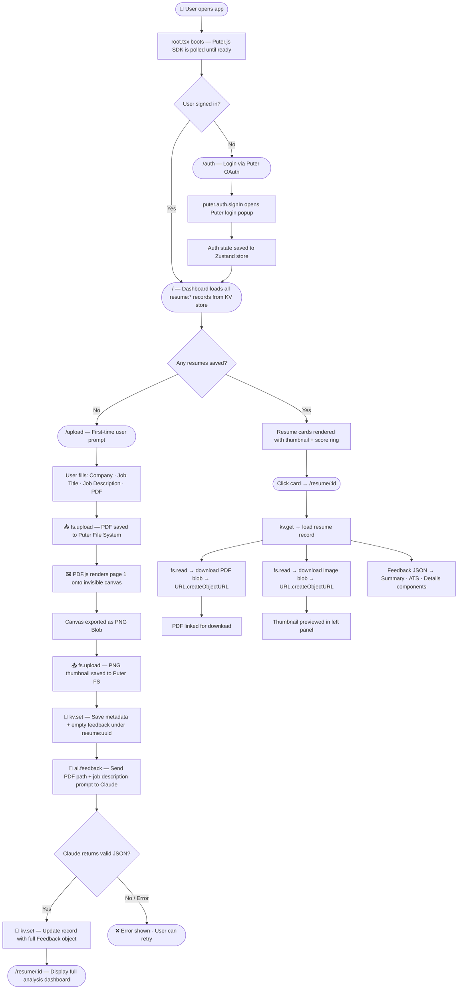

<div align="center">

# 🎯 FitCheck.dev

### AI-Powered Resume Analyzer — Get ATS scores, category breakdowns, and actionable feedback tailored to any job listing.

[](https://react.dev/)
[](https://reactrouter.com/)
[](https://www.typescriptlang.org/)
[](https://tailwindcss.com/)
[](https://vitejs.dev/)
[](https://zustand-demo.pmnd.rs/)

</div>

---

## 📌 What Is This?

FitCheck.dev is a **zero-backend AI resume analyzer** built entirely in the browser. Drop in your resume PDF and a job description — the app converts your resume to an image, sends it to **Claude (Anthropic)** via Puter.js, and returns a structured, multi-category analysis with scores and tips.

> **No server. No database. No API keys to manage.** All auth, file storage, AI inference, and data persistence happen client-side through **Puter.js**.

---

## 🖥️ Screenshots

### Full Review Dashboard
> Side-by-side layout: resume PDF preview (sticky left panel) + AI feedback (scrollable right panel). Click the resume image to open the original PDF.


---

### Overall Score + Category Breakdown
> A custom SVG semi-circle gauge shows the overall score. Each category gets a score and color-coded badge — **green (Strong >70)**, **yellow (Good Start >49)**, **red (Needs Work)**.

<table>
  <tr>
    <td></td>
    <td></td>
  </tr>
  <tr>
    <td align="center"><em>Overall score gauge + category breakdown</em></td>
    <td align="center"><em>ATS card — specific pass/fail tips from the AI</em></td>
  </tr>
</table>

---

### Detailed Category Feedback — Accordion UI
> Each category (Tone & Style, Content, Structure, Skills) expands into a grid of ✅ strengths and ⚠️ improvements. Built with a hand-rolled **compound Accordion** using React Context — no third-party UI library.

<table>
  <tr>
    <td></td>
    <td></td>
  </tr>
  <tr>
    <td align="center"><em>Tone & Style — 78/100</em></td>
    <td align="center"><em>Structure — 80/100</em></td>
  </tr>
  <tr>
    <td></td>
    <td></td>
  </tr>
  <tr>
    <td align="center"><em>Content — 68/100</em></td>
    <td></td>
  </tr>
</table>

---

## 🔄 How It Works — Full Data Flow



---

## 🏗️ Architecture

FitCheck.dev is a **React Router v7 application** with no traditional backend.  
**Puter.js** replaces the entire server stack:

| Puter.js Service | Used For | Equivalent In Traditional Stack |
|---|---|---|
| `puter.auth` | Browser-native OAuth login | Auth0 / Passport.js / JWT |
| `puter.fs` | Per-user cloud file storage | AWS S3 / Cloudinary |
| `puter.ai.chat()` | Claude AI inference | OpenAI API / custom LLM server |
| `puter.kv` | Persistent key-value store | Redis / MongoDB |

All four services are wrapped in a single **Zustand store** (`app/lib/puter.ts`) using the **Facade Pattern** — components never import from Puter directly. If the underlying SDK ever changes, only one file needs updating.

---

## 📁 Project Structure

```
FitCheck.dev/
│
├── app/
│   ├── root.tsx              # App shell — loads Puter SDK, initializes Zustand store
│   ├── routes.ts             # Route declarations: 5 URL → component mappings
│   ├── app.css               # Global design tokens, component classes
│   │
│   ├── routes/
│   │   ├── home.tsx          # Dashboard — fetches resume:* from KV, renders cards
│   │   ├── auth.tsx          # Login/logout with redirect-after-auth (?next=) flow
│   │   ├── upload.tsx        # ⭐ Core — PDF upload → PDF.js → AI → KV → navigate
│   │   ├── resume.tsx        # Results page — loads blobs, renders feedback panels
│   │   └── wipe.tsx          # Dev utility — clears all KV + FS data
│   │
│   ├── components/
│   │   ├── Accordion.tsx     # Compound component pattern (React Context)
│   │   ├── Details.tsx       # Accordion sections for each feedback category
│   │   ├── ATS.tsx           # ATS score card with tip list
│   │   ├── Summary.tsx       # Score gauge + category breakdown table
│   │   ├── ScoreGauge.tsx    # Custom SVG semi-circle gauge
│   │   ├── ScoreCircle.tsx   # Custom SVG circular ring (dashboard cards)
│   │   ├── ScoreBadge.tsx    # Colored pill badge (Strong / Good Start / Needs Work)
│   │   ├── ResumeCard.tsx    # Dashboard card — thumbnail + score + navigation link
│   │   ├── FileUploader.tsx  # Drag-and-drop PDF input (react-dropzone)
│   │   └── Navbar.tsx        # Top navigation
│   │
│   ├── lib/
│   │   ├── puter.ts          # ⭐ Zustand store — Facade over all Puter.js services
│   │   ├── pdf2img.ts        # PDF.js + Canvas API → PNG conversion (lazy-loaded)
│   │   └── utils.ts          # cn(), formatSize(), generateUUID()
│   │
│   └── constants/
│       └── index.ts          # AI prompt builder — prepareInstructions + AIResponseFormat
│
├── types/
│   └── index.d.ts            # Global TypeScript interfaces: Feedback, Resume, KVItem
│
├── public/                   # Static assets — images, icons, PDF.js worker bundle
├── Dockerfile                # Production container
└── react-router.config.ts    # SSR / SPA configuration
```

---

## 🧠 Key Engineering Decisions

### 1. Facade Pattern over `window.puter`
Rather than calling `window.puter.*` directly in components, every Puter interaction goes through a single Zustand store (`puter.ts`). Components call `usePuterStore()` and get `auth`, `ai`, `fs`, `kv` — clean, typed, and decoupled from the SDK. Swapping Puter for another BaaS would mean editing exactly one file.

### 2. PDF → Canvas → PNG Pipeline (pdf2img.ts)
The dashboard needs image thumbnails, not live PDF embeds. The pipeline:
1. Read the PDF as an `ArrayBuffer`
2. Pass it to `pdfjs-dist` (Mozilla's renderer) to get a document object
3. Render page 1 onto an off-screen `<canvas>` at 4× scale for sharpness
4. Export the canvas as a PNG `Blob` and upload it alongside the source PDF

PDF.js itself is **lazy-loaded and memoized** — the ~2MB bundle is fetched only once, only when first needed, even if the function is called in parallel.

### 3. Compound Accordion with React Context
The feedback detail view uses a hand-built accordion (`Accordion.tsx`) with four sub-components: `Accordion`, `AccordionItem`, `AccordionHeader`, `AccordionContent`. State ("which item is open") lives in a Context Provider, so any descendant can read it without prop drilling. This is the same pattern used by headless UI libraries like Radix.

### 4. Structured AI Prompt Contract
The prompt sent to Claude (`prepareInstructions`) includes the TypeScript `Feedback` interface (pasted as a string) as the response schema. The AI is instructed to return *only* raw JSON, no markdown, no preamble. This makes the output directly parseable and typed against `types/index.d.ts` — the AI's output shape and the UI's input shape are defined in the same place.

### 5. UUID-keyed KV Namespace
Every resume analysis is stored under `resume:{crypto.randomUUID()}`. Using the browser's native `crypto.randomUUID()` (cryptographically random) rather than `Math.random()` ensures namespace safety even across many concurrent users sharing the same Puter account.

---

## ⚙️ Tech Stack

| Technology | Version | Role |
|---|---|---|
| React | 19 | UI rendering and component model |
| React Router | v7 | File-based routing, SSR support |
| TypeScript | 5.x | Full type safety across AI response + UI contract |
| Tailwind CSS | v4 | Utility-first styling with custom design tokens |
| Zustand | v5 | Minimal global state — no Provider boilerplate |
| Puter.js | v2 | Auth + File System + Claude AI + KV Database |
| pdfjs-dist | v5 | Client-side PDF rendering to canvas |
| Vite | v7 | Dev server + production bundler |

---

## 🚀 Getting Started

**Prerequisites:** Node.js 18+ · A free [Puter.com](https://puter.com) account

```bash
# 1. Clone
git clone https://github.com/arnavsharma1811/FitCheck.dev.git
cd FitCheck.dev

# 2. Install dependencies
npm install

# 3. Start dev server
npm run dev
# → http://localhost:5173
```

### Production Build
```bash
npm run build
npm run start
```

### Docker
```bash
docker build -t fitcheck .
docker run -p 3000:3000 fitcheck
```

---

## 🔑 Zero Configuration

No `.env` file. No API keys. No billing setup.

Puter.js routes AI calls through the user's own Puter account — inference costs are per-user, not per-developer. You deploy this app and pay nothing for AI usage.

---

## 📝 License

MIT — free to use, fork, and build on.

---

<div align="center">
  Built by <strong><a href="https://github.com/arnavsharma1811">Arnav Sharma</a></strong><br>
  B.Tech Computer Science · Symbiosis Institute of Technology, Pune
</div>
